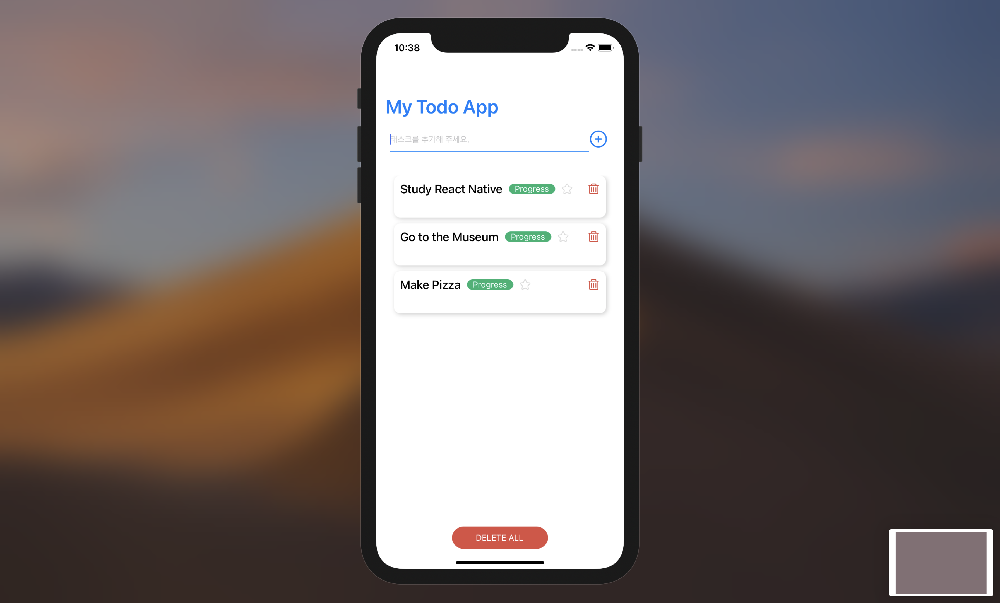
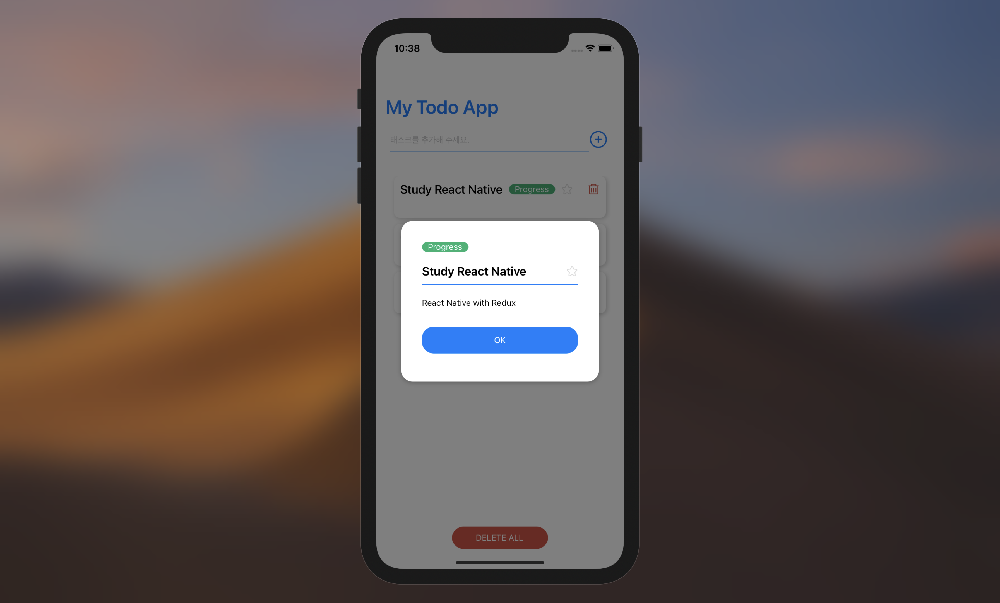

# 📆 My To Do App

리액트 네이티브를 이용한 투두 리스트 애플리케이션 입니다.
- **개발 기간 :** 2021/02/20 ~ 2021/02/22





<br>

## 🛠 Tech Stack
  - JavaScript
  - React Native
  - Redux
  - Redux toolkit

<br>

## 💾 Usage

- **Requirements & Installation**

  - Ios 환경에서 사용이 가능합니다.

```

git clone https://github.com/midohree/react-native-todo.git
npm install
npm run start
npm run ios (Emulator)

```

<br>

## ✨ Features

- 할 일을 리스트에 추가 할 수 있습니다.
- 각 항목을 삭제하거나 전체 항목을 삭제 할 수 있습니다.
- 항목을 눌러 작업의 진행 상태를 변경 할 수 있습니다.
- 중요한 항목은 즐겨찾기를 선택 할 수 있습니다.
- 항목을 길게 눌러 상세 설명을 기입 할 수 있습니다.

<br>

## 🌊 Details

**리덕스와 리덕스 툴킷 사용**

리액트 컴포넌트 별로 각각의 state를 외부 라이브러리 없이 관리 할 수도 있지만 컴포넌트 양이 많아지고 컴포넌트 사이에서 state를 쉐어해야 할 경우가 늘어나면 해당 컴포넌트들이 공통으로 가지고 있는 부모 컴포넌트로 소위 말하는 state up lifting을 해야 합니다. 이 방식은 상태를 공유해야하는 컴포넌트들이 많아지면 급속도로 복잡해집니다. Redux를 이용하면 state lifting 없이 각각의 컴포넌트에서 store에 바로 접근이 가능하기 때문에 전역 상태를 원하는 때에 불러와 사용 할 수 있고 상태 추적에도 용이하기 때문에 Redux를 사용했습니다.

또한 redux-toolkit을 사용해 actions와 reducer를 하나로 합쳐주는 createSlice를 통해 기능별로 폴더를 나누는 형식의 ducks pattern을 사용해 디렉토리 구조를 새로 짜보았습니다. 기존에 redux를 사용했을 때에는 actions, reducers, constatns등 하나의 기능을 구현하기 위해 파일을 모두 분리했어야 했는데 redux toolkit의 slice를 통해 actions와 reducers를 통합해 보다 명시적인 폴더 구성을 이루고자 했습니다.

